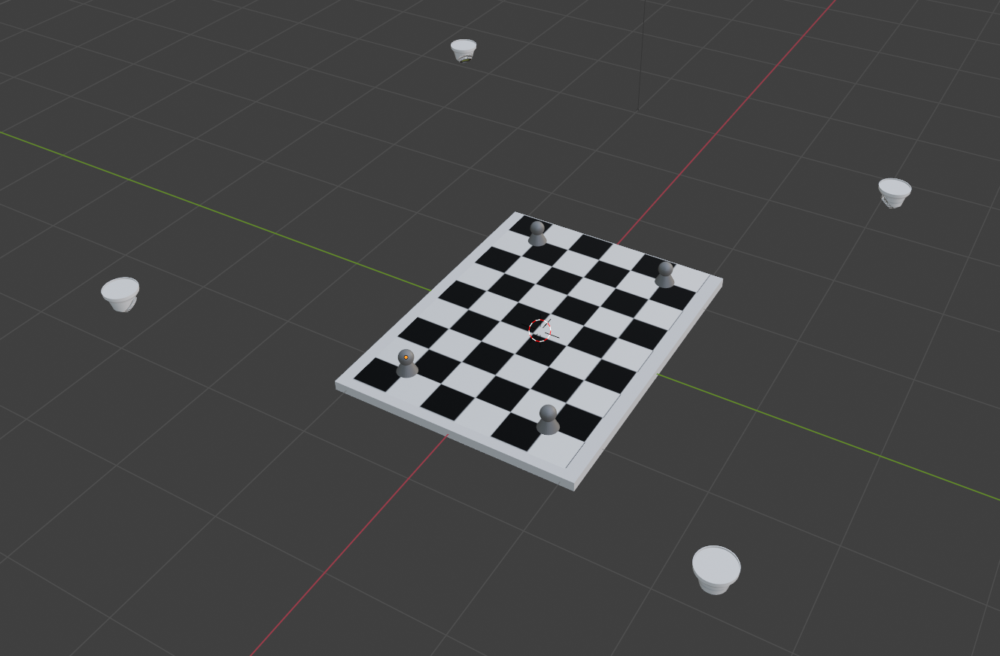
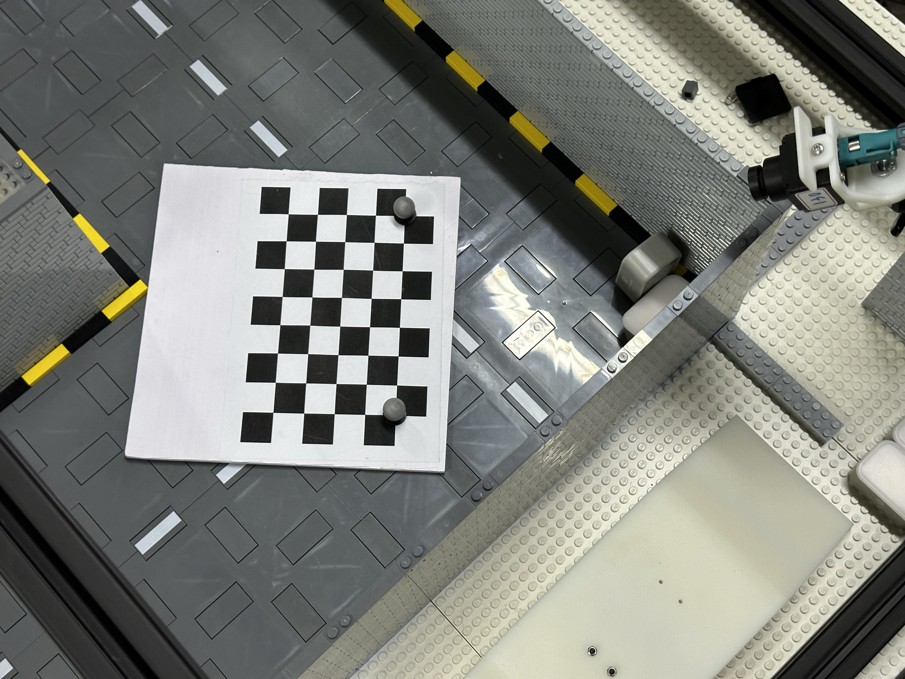
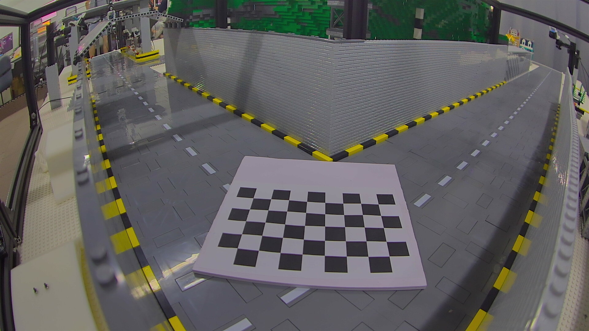
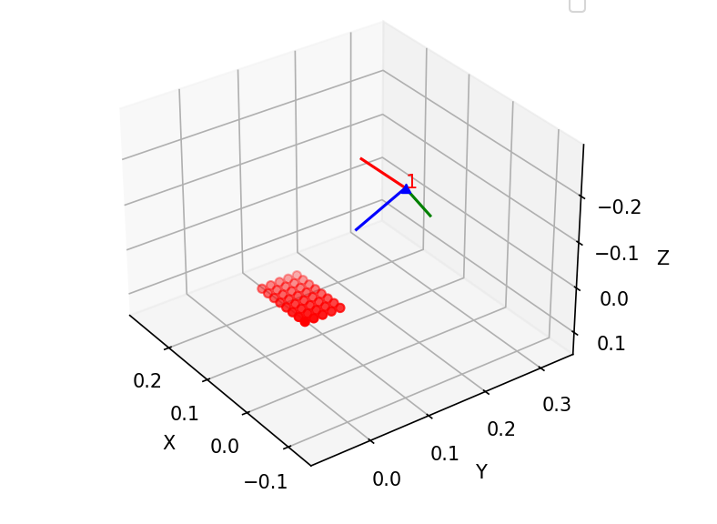
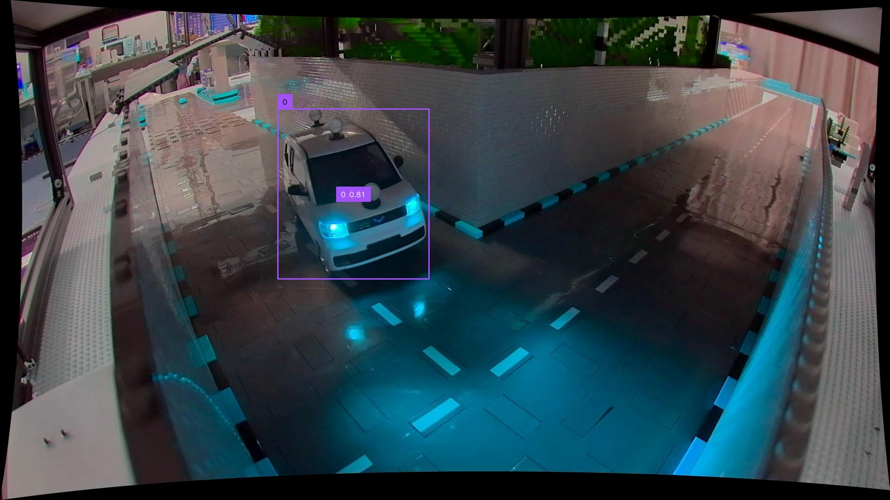

# Local2MT：将相机局部坐标系与动捕坐标系(或者GPS坐标系)对齐的方法

[English](./README_en.md)

## 0x1 准备工作

确保摄像机内参和畸变系数已经被正确标定

准备如图的，贴上动捕球的棋盘格

动捕球分别位于棋盘格的四个角

然后放置棋盘格于场景中，确保四个动捕球均能被动捕系统捕获

分别记录下4个动捕球在动捕坐标系下的位置(按照棋盘格顺序，左上、右上、左下、右下)

然后轻轻移除动捕球，确保棋盘格位置不被剧烈改变，然后使用摄像机拍摄棋盘格照片

你会拍照得到如下的图片

这个照片不用于相机局部坐标系与动捕坐标系对齐，但是会用来解算相机的外参

## 0x2 解算相机外参

解算的相机外参是摄像机相对于棋盘格某一原点(这个是自己定义的原点在哪里)的位姿

修改脚本 `solve_extrinsics.py` 里面的相机内参和畸变系数与相机实际参数相符合，然后运行脚本，可以可视化的看出摄像机相对于棋盘格的位置以及姿态

脚本同时会将 `camera.json` 输出到 `./output` 目录下，用于后续测试脚本使用

## 0x03 解算相机坐标系到动捕坐标系仿射矩阵

这一步利用采集的4个动捕球的坐标以及棋盘格的角点坐标(人为规定的)来获得两者之间的变换仿射矩阵

修改脚本 `solve_Local2MT.py` 里面动捕坐标系下的4个点（motion_tracking_points），注意动捕软件里面显示的坐标是 xzy， 需要调整为 xyz 的格式输入脚本，然后运行脚本

脚本会输出 `affine_matrix.json` 到 `./output` 目录下，用于后续测试脚本使用

## 0x04 测试

测试将把图片中的二维坐标，通过射线与地面相交的方式（需要用到摄像头外参），获取到车辆大致在摄像机坐标系下的位置（因为车辆中心实际上不是完全贴在地面上，而是有一定高度的，因此这个位置是不太准确的）

然后将摄像机坐标系下的3d位置通过 affine_matrix 转换成动捕坐标系下的位置

运行 `example_convert.py` 即可看到输出的结果