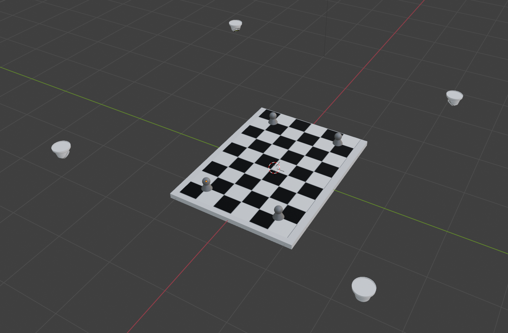
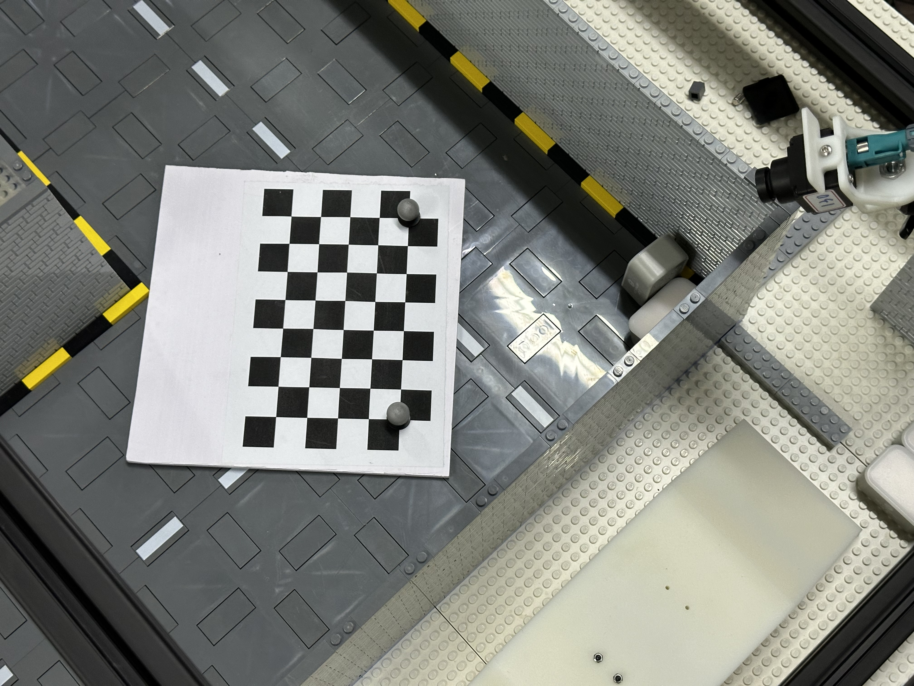
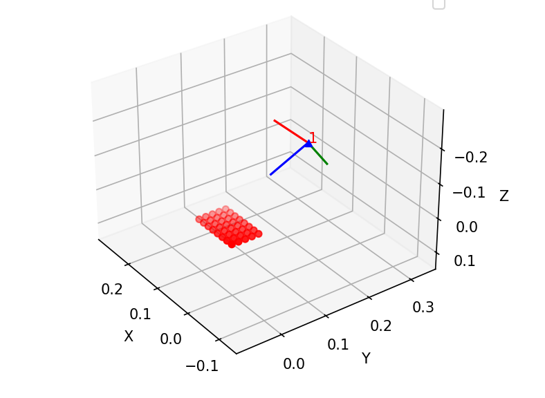
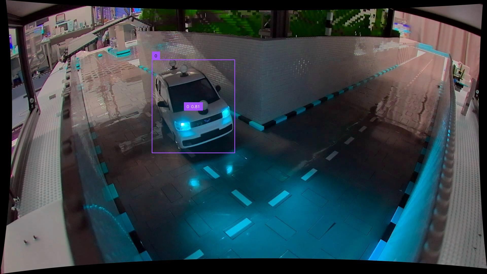

# Local2MT: Method for Aligning Camera Local Coordinate System with Motion Capture (or GPS) Coordinate System

[Chinese](./README.md)

## 0x1 Preparation

Ensure that the camera's intrinsic parameters and distortion coefficients have been correctly calibrated.

Prepare a checkerboard with motion capture markers attached to it, as shown in the image.

The motion capture markers should be placed at the four corners of the checkerboard.

Then place the checkerboard in the scene, ensuring that all four motion capture markers can be detected by the motion capture system.

Record the positions of the four motion capture markers in the motion capture coordinate system (in the order of the checkerboard, top-left, top-right, bottom-left, bottom-right).

Carefully remove the motion capture markers, ensuring that the position of the checkerboard is not significantly altered, and then take a photo of the checkerboard with the camera.

You will get an image like this:

This photo will not be used to align the camera local coordinate system with the motion capture coordinate system but will be used to solve the camera's extrinsic parameters.

## 0x2 Solving Camera Extrinsic Parameters

The extrinsic parameters solved are the camera's pose relative to a defined origin point on the checkerboard (the origin point is user-defined).

Modify the script `solve_extrinsics.py` to match the camera's intrinsic parameters and distortion coefficients with the actual camera parameters, then run the script. This will visually show the camera's position and orientation relative to the checkerboard.

The script will also output `camera.json` to the `./output` directory for use in subsequent test scripts.

## 0x03 Solving the Affine Matrix from Camera Coordinate System to Motion Capture Coordinate System

This step uses the coordinates of the four captured motion capture markers and the coordinates of the checkerboard corners (defined manually) to obtain the transformation affine matrix between the two.

Modify the script `solve_Local2MT.py` to include the four points in the motion capture coordinate system (`motion_tracking_points`). Note that the coordinates displayed in the motion capture software are in xzy format and need to be adjusted to xyz format for input into the script, then run the script.

The script will output `affine_matrix.json` to the `./output` directory for use in subsequent test scripts.

## 0x04 Testing

The test will take the 2D coordinates in the image, intersect them with the ground plane (using the camera's extrinsic parameters), and obtain the approximate position of the vehicle in the camera coordinate system (since the center of the vehicle is not perfectly on the ground but has some height, this position is not very accurate).

Then, convert the 3D position in the camera coordinate system to the position in the motion capture coordinate system using the affine matrix.

Run `example_convert.py` to see the output results.
